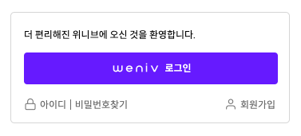

#Login Page(기본)

- 멋쟁이사자처럼 프론트엔드 스쿨 과제

## 1. 목표

- Figma를 사용해서 디자인을 정확히 구현할 것

### 2. 개발언어 및 배포

### 2.1 개발언어

- HTML Living Standard
- CSS

### 2.2 배포

- Github Pages 사용
- url

## 3. Preview

## 4. 개발하며 어려웠던 점

- 처음으로 Figma 툴을 사용해서 퍼블리싱 작업을 했었는데 정말.. 매우 어려웠다. 사실 가볍게 보고 있었는데 진짜 너무 어려웠고, 뭘 참고해야할지 아니면 전부 똑같이 해야하는 것인지 잘몰라서 많이 헤맸다.

- Figma에서 가져올 값들을 어느 정도는 알고 있게 되었다. 예를 들면 색상, 폰트, 넓이, border-radius, border 등등,, position 같은 경우는 너무 투머치임 이번 과제를 통해서 float는 어떻게 정렬에 사용이 되는지도 알았지만 아직 많이 헷갈리는건 사실이다. 좀 더 많이 사용해보면서 익숙해져야할 것 같다.
